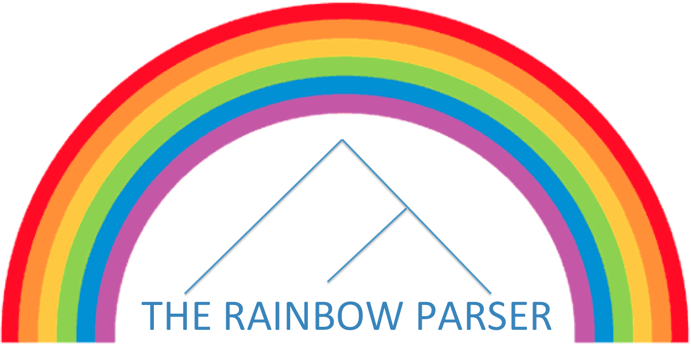

##  The Rainbow Parser, version 0.1

### Synopsis

This project includes code for training and decoding with latent-variable probabilistic context-free grammars (L-PCFGs). It includes training algorithms such as the expectation-maximization algorithm of Matsuzaki et al. (2005) and the spectral algorithms of Cohen et al. (2013) and Narayan and Cohen (2015; 2016). (See references below.) Decoding is done using a CKY chart parser with pruning.

### Some Things to Consider

* The L-PCFG formalism used is described by Cohen et al. (2014). More specifically, there are two types of rules: lexical rules a -> x where a is a preterminal and x is a word and binary rules a -> b c where a, b, c are nonterminals or preterminals. As such, the grammar is in a restricted Chomsky normal form, where there is a distinction between internal nonterminals and preterminals. The internal nonterminals are also called interminals. The root of a derivation tree can only be an interminal.

* Because of the restrictions above on the grammar, this parser cannot parse single-word sentences. It requires at least two words in order to parse.

* The code is written in a combination of C++ (decoder and EM algorithm) and Java with Matlab (spectral training algorithms). The decoder was written in C++ to optimize for speed. The training algorithms require Matlab 15 or above.

* The training algorithm using spectral methods (Matlab code) can be multithreaded. However, this has been reported to create problems on some machines. If your code abruptly aborts sometimes because of the multithreading of the nonterminal calculations, remove the multithreading support by changing the .m files in the train/src/Source directory: all "parfor" directives should be changed to "for", and all "parpool" and "delete(parobject)" commands should be commented out.

### Installation

1. Change directory to the decode/ directory, then run "./configure" followed by "make". This should compile a binary called lpcfgparser in the src/ directory. This binary is the main driver behind the decoder. You need a C++ compiler that supports the "-std=c++0x" flag.

2. Change directory to the train/ directory, then run "python config.py". This should create a file called javaclasspath.txt with absolute paths for the .jar files in the package.

### Running the Trainer (Spectral)

The trainer resides in the train/src directory. You need Matlab15 to run it, and you usually need to run it from the src/ directory. There is a file called

	set_global_parameters.m

that contains all the settings for the algorithm (except for the smoothing parameters). See the file itself for the options you have with training.
Then check out

	run_clusterestimation_algorithm.m

and

	run_spectralestimation_algorithm.m

which are the main execution files for the clustering algorithm of Narayan and Cohen (2015) and the spectral algorithm of Cohen et al. (2013). These files also contain the settings for the smoothing parameters as specified in Cohen et al. (2013).

Once you have run the trainer, there will be several files created in the output directory:

1. grammar-prune.txt - this is the grammar with no latent states that is estimated from the data and should be used as prune-grammar for decoding.

2. train.vocab.parsing - this is the vocabulary file that should be used as vocab-file below for decoding.

3. The grammar that was estimated will reside in a directory that starts with "Standard". If you used the default Matlab file, it will have a specific signature that looks like grammar-2d3e6bb2-c021-4349-9058-ca75bde3ccdb.txt.

Note that you do not have to re-generate the SVD and the inside-outside files every time from scratch, these can be calculated only once, and then re-used for other grammar estimations. See the .m files for more information.

For vocab-threshold, use the same number you used in the set_global_parameters.m file as obj_globalparam.rarewordCutoff.

Please note that the Matlab/Java code binarizes the trees and also collapses unary rules into a single node. This means that the grammar that you get may use a different set of nonterminals than in the original treebank. The binarization process is based on the code from the Berkeley parser with some added code for collapsing the unary rules.

### Running the Trainer (Expectation-Maximization)

The EM algorithm code is more impoverished, and runs in C++. It is part of the decode/ directory source files, as a matter of fact.

You can run it by typing from the scripts/ directory

	python lpcfgem.py [treebank-file] [output-prefix-grammar-file] [vocab-file] [vocab-threshold] [latent-state-number] [iterations-number] [scale-factor]

where

* treebank-file is an input treebank which will be binarized by using norm-trees.sh in the scripts/ directory.
* output-prefix-grammar-file is an output prefix for outputting all the intermediate files such as the grammar files after each iteration and other files.
* vocab-file is a vocabulary file in the same format created by the spectral trainer (so you can use a vocabulary file from there), or alternatively, create a file with all words in the training set and their counts, separated by space. Unfortunately, the EM code does not generate a vocabulary file on its own.
* vocab-threshld is the cutoff x before a word is replaced by its part-of-speech (preterminal) tag (if its count <= x).
* latent-state-number is the number of latent states to use with all nonterminals in the input treebank.
* iterations-number is the number of iterations to run the EM algorithm.
* scale-factor does not have to be specified, the default is 1.5. It helps when the EM algorithm underflows (the probabilities get too small). See trick in code -- basically all preterminal rules are multiplied by scale-factor.

Several files are generated by the EM execution, if successful. The grammar files (suffix gra), a prune grammar file (no latent states maximum likelihood estimation, relative frequency, grammar) and the vocabulary file (copied from input). Any of the grammar files at each iteration, the vocabulary file and the prune grammar can be used with the decoder as specified below.

### Running the Decoder

To parse, use lpcfgparser.py in the scripts/ directory.

You can run it by typing from the scripts/ directory

	python lpcfgparser.py [sentence-file] [grammar-file] [prune-grammar] [vocab-file] [vocab-threshold] [prune-threshold]

where

* sentence-file is just a pre-tokenized sentence file (one sentence per line, words/tokens separated by space).
* grammar-file is the grammar file you want to use from one of the training algorithms
* prune-grammar is the grammar file used for pruning the chart. It is important for speed, and you always have to specify one.
* vocab-file is the vocabulary file created based on the training set by the training algorithm.
* vocab-threshold is the threshold you used in the training algorithm in the .m parameter file (or the threshold you used with the EM algorithm).
* prune-threshold is the minimal value for an item on the chart to have so it is not pruned. Use 0 if you don't want to use pruning (but you still have to specify a prune grammar, which is automatically generated by the training algorithms). This defaults to 1e-4 if not specified.

The python script calls the main binary lpcfgparser driver, and outputs the parses to the standard output. If it cannot parse a sentence for some reason, it will output "( )". All trees are output in standard bracketing format such as in the Penn Treebank.

Note that the lpcfgparser.py script uses ^ as a special symbol for the different tokens. If the parser sees a token x^y, it will only take x to be the word to be parsed.

### Normalizing Treebanks

The algorithms implemented in this project all assume a binary trees with preterminals. The treebanks that often come in practice do not have to contain binary trees.
We also include two scripts for binarizing and debinarizing treebanks. Both of them are in the scripts/ directory.

To binarize trees use:

	./norm-trees.sh --originalparsetrees [original-treebank-filename] --normalisedparsetrees [output-in-binarized-form-filename]

To debinarize trees use:

	./denorm-trees.sh --normalisedparsetrees [original-treebank-in-binarized-form-filename] --denormalisedparsetrees [output-in-debinarized-form-filename]

Note that all grammars that are generated with the code in this project output binarized trees when parsed with.

### Authors

The Rainbow Parser was written by Shashi Narayan and Shay Cohen at the University of Edinburgh. We thank the members of the cohort for testing and debugging some of this code (http://cohort.inf.ed.ac.uk). All of the code is based on the references as specified below.

We encourage contributions to this project, and can be reached at shashi.narayan@ed.ac.uk or scohen@inf.ed.ac.uk for discussions.

### Demo

If you are interested in seeing a demo of the different grammars estimated for different languages, as described in Narayan and Cohen (2016), see: http://cohort.inf.ed.ac.uk/lpcfgviewer/index.php. Also, if you would like to see the benchmark results of running this code on different treebanks, see http://cohort.inf.ed.ac.uk/lpcfg.html. This page also includes downloadable models that can be used with the decoder.

### References

1. Spectral Learning of Latent-Variable PCFGs, Shay B. Cohen, Karl Stratos, Michael Collins, Dean P. Foster and Lyle Ungar, In ACL 2012
2. Experiments with Spectral Learning of Latent-Variable PCFGs, Shay B. Cohen, Karl Stratos, Michael Collins, Dean P. Foster and Lyle Ungar, In NAACL 2013
3. Spectral Learning of Latent-Variable PCFGs: Algorithms and Sample Complexity, Shay B. Cohen, Karl Stratos, Michael Collins, Dean P. Foster and Lyle Ungar, In JMLR 2014
4. Diversity in Spectral Learning for Natural Language Parsing, Shashi Narayan and Shay B. Cohen, In EMNLP 2015
5. Optimizing Spectral Learning for Parsing, Shashi Narayan and Shay B. Cohen, In ACL 2016

### License

Copyright (c) 2017, Shashi Narayan and Shay Cohen. All rights reserved.

Redistribution and use in source and binary forms, with or without modification, is permitted. 

THIS SOFTWARE IS PROVIDED BY THE COPYRIGHT HOLDERS AND CONTRIBUTORS "AS IS" AND ANY EXPRESS OR IMPLIED WARRANTIES, INCLUDING, BUT NOT LIMITED TO, THE IMPLIED WARRANTIES OF MERCHANTABILITY AND FITNESS FOR A PARTICULAR PURPOSE ARE DISCLAIMED. IN NO EVENT SHALL THE COPYRIGHT HOLDER OR CONTRIBUTORS BE LIABLE FOR ANY DIRECT, INDIRECT, INCIDENTAL, SPECIAL, EXEMPLARY, OR CONSEQUENTIAL DAMAGES (INCLUDING, BUT NOT LIMITED TO, PROCUREMENT OF SUBSTITUTE GOODS OR SERVICES; LOSS OF USE, DATA, OR PROFITS; OR BUSINESS INTERRUPTION) HOWEVER CAUSED AND ON ANY THEORY OF LIABILITY, WHETHER IN CONTRACT, STRICT LIABILITY, OR TORT (INCLUDING NEGLIGENCE OR OTHERWISE) ARISING IN ANY WAY OUT OF THE USE OF THIS SOFTWARE, EVEN IF ADVISED OF THE POSSIBILITY OF SUCH DAMAGE.

Note that this project includes jar files from several other projects:

* berkeleyParser.jar - the Berkeley parser (used for preprocessing treebank trees in Java)
* colt.jar - used for matrix calculations
* commons-cli-1.2.jar - Apache commons used for general routines
* trove.jar - Trove, used for working with data structures.

These are provided separately perhaps with a different license. They are provided in this project to avoid version mismatch when downloading them.

